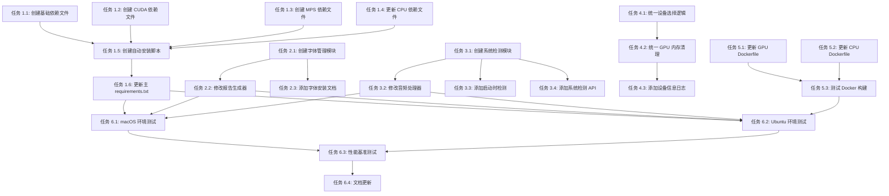

# 跨平台兼容性适配任务清单

## 任务概览

本文档列出了实现跨平台兼容性所需的所有具体任务。每个任务都包含详细的实施步骤和验收标准。

---

## 阶段 1：依赖管理重构

### 任务 1.1：创建基础依赖文件
**优先级**: 高  
**预估时间**: 30 分钟  
**负责人**: 待分配

#### 实施步骤
1. 创建 `requirements-base.txt` 文件
2. 从 `requirements.txt` 中提取所有非 PyTorch 依赖
3. 确保包含以下核心依赖：
   - FastAPI 相关
   - 数据库相关（SQLAlchemy, Alembic）
   - 音频处理（librosa, soundfile, scipy）
   - 视频处理（opencv-python, av, scenedetect）
   - 图像处理（pillow）
   - 工具库（tqdm, httpx, aiofiles, python-dotenv, pyyaml）

#### 验收标准
- [ ] `requirements-base.txt` 包含所有非 PyTorch 依赖
- [ ] 依赖版本与原 `requirements.txt` 一致
- [ ] 文件格式正确，无语法错误

---

### 任务 1.2：创建 CUDA 依赖文件
**优先级**: 高  
**预估时间**: 15 分钟  
**负责人**: 待分配

#### 实施步骤
1. 创建 `requirements-cuda.txt` 文件
2. 添加 CUDA 版本的 PyTorch：
   ```
   --index-url https://download.pytorch.org/whl/cu121
   torch==2.5.1+cu121
   torchaudio==2.5.1+cu121
   ```
3. 添加 CUDA 相关的其他依赖（如有）

#### 验收标准
- [ ] `requirements-cuda.txt` 包含 CUDA 版本的 PyTorch
- [ ] 指定了正确的 CUDA 12.1 索引 URL
- [ ] 版本号与 spec.md 一致

---

### 任务 1.3：创建 MPS 依赖文件
**优先级**: 高  
**预估时间**: 15 分钟  
**负责人**: 待分配

#### 实施步骤
1. 创建 `requirements-mps.txt` 文件
2. 添加 MPS 版本的 PyTorch（macOS 默认支持）：
   ```
   torch==2.5.1
   torchaudio==2.5.1
   ```

#### 验收标准
- [ ] `requirements-mps.txt` 包含标准版本的 PyTorch
- [ ] 版本号与 CUDA 版本一致（不含平台后缀）

---

### 任务 1.4：更新 CPU 依赖文件
**优先级**: 高  
**预估时间**: 15 分钟  
**负责人**: 待分配

#### 实施步骤
1. 更新 `requirements-cpu.txt` 文件
2. 确保 PyTorch 版本一致：
   ```
   --index-url https://download.pytorch.org/whl/cpu
   torch==2.5.1+cpu
   torchaudio==2.5.1+cpu
   ```

#### 验收标准
- [ ] `requirements-cpu.txt` 包含 CPU 版本的 PyTorch
- [ ] 版本号与 spec.md 一致

---

### 任务 1.5：创建自动安装脚本
**优先级**: 高  
**预估时间**: 45 分钟  
**负责人**: 待分配

#### 实施步骤
1. 创建 `scripts/install_deps.py` 文件
2. 实现平台检测逻辑
3. 实现 GPU 检测逻辑（Linux 下检测 CUDA）
4. 根据检测结果选择合适的依赖文件
5. 添加错误处理和日志输出
6. 添加命令行参数支持：
   - `--platform`: 手动指定平台（cuda/mps/cpu）
   - `--verbose`: 详细输出

#### 验收标准
- [ ] 脚本能正确检测操作系统
- [ ] 脚本能正确检测 GPU（Linux 下）
- [ ] 脚本能安装正确的依赖
- [ ] 错误提示清晰友好
- [ ] 支持命令行参数

---

### 任务 1.6：更新主 requirements.txt
**优先级**: 高  
**预估时间**: 15 分钟  
**负责人**: 待分配

#### 实施步骤
1. 更新 `requirements.txt` 文件
2. 添加说明注释，指向自动安装脚本
3. 保留通用依赖作为参考

#### 验收标准
- [ ] `requirements.txt` 包含安装说明
- [ ] 用户能理解如何安装依赖

---

## 阶段 2：字体管理模块

### 任务 2.1：创建字体管理模块
**优先级**: 高  
**预估时间**: 45 分钟  
**负责人**: 待分配

#### 实施步骤
1. 创建 `src/utils/fonts.py` 文件
2. 实现 `FontManager` 类：
   - `FONT_REGISTRY`: 平台字体路径字典
   - `FALLBACK_FONTS`: 备用字体列表
   - `get_font_path()`: 获取字体路径
   - `register_fonts()`: 注册字体到 ReportLab
3. 添加详细的错误处理和日志
4. 添加单元测试

#### 验收标准
- [ ] `FontManager` 类实现完整
- [ ] 支持 macOS/Linux/Windows 三个平台
- [ ] 有 fallback 机制
- [ ] 错误处理完善
- [ ] 有单元测试

---

### 任务 2.2：修改报告生成器
**优先级**: 高  
**预估时间**: 30 分钟  
**负责人**: 待分配

#### 实施步骤
1. 打开 `src/services/report/generator.py`
2. 删除硬编码的字体注册代码（第 18-19 行）
3. 导入 `FontManager`
4. 在 `ReportGenerator.__init__()` 中调用 `FontManager.register_fonts()`
5. 更新字体引用（STHeiti -> CN）
6. 添加字体缺失的错误处理

#### 验收标准
- [ ] 删除了硬编码字体路径
- [ ] 使用 `FontManager` 注册字体
- [ ] PDF 生成功能正常
- [ ] 错误提示友好

---

### 任务 2.3：添加字体安装文档
**优先级**: 中  
**预估时间**: 15 分钟  
**负责人**: 待分配

#### 实施步骤
1. 更新 `README.md` 或创建 `docs/FONT_INSTALLATION.md`
2. 添加各平台字体安装指南
3. 添加字体验证命令

#### 验收标准
- [ ] 文档清晰易懂
- [ ] 包含各平台安装命令
- [ ] 包含验证方法

---

## 阶段 3：系统依赖检测

### 任务 3.1：创建系统检测模块
**优先级**: 中  
**预估时间**: 45 分钟  
**负责人**: 待分配

#### 实施步骤
1. 创建 `src/utils/system_check.py` 文件
2. 实现 `SystemChecker` 类：
   - `check_ffmpeg()`: 检测 ffmpeg
   - `check_gpu()`: 检测 GPU
   - `check_fonts()`: 检测字体
   - `full_check()`: 完整检测
3. 添加详细的错误信息和安装指南
4. 添加单元测试

#### 验收标准
- [ ] `SystemChecker` 类实现完整
- [ ] 各检测方法返回详细结果
- [ ] 错误信息包含安装指南
- [ ] 有单元测试

---

### 任务 3.2：修改音频处理器
**优先级**: 中  
**预估时间**: 20 分钟  
**负责人**: 待分配

#### 实施步骤
1. 打开 `src/services/audio/processor.py`
2. 导入 `SystemChecker`
3. 在 `extract_audio()` 方法开始处添加 ffmpeg 检测
4. 添加友好的错误提示

#### 验收标准
- [ ] 添加了 ffmpeg 检测
- [ ] 错误提示友好
- [ ] 不影响正常功能

---

### 任务 3.3：添加启动时检测
**优先级**: 中  
**预估时间**: 30 分钟  
**负责人**: 待分配

#### 实施步骤
1. 打开 `src/api/main.py`
2. 在应用启动时调用 `SystemChecker.full_check()`
3. 记录检测结果到日志
4. 如果关键依赖缺失，发出警告（但不阻止启动）

#### 验收标准
- [ ] 启动时执行检测
- [ ] 检测结果记录到日志
- [ ] 缺失依赖时有警告

---

### 任务 3.4：添加系统检测 API
**优先级**: 低  
**预估时间**: 30 分钟  
**负责人**: 待分配

#### 实施步骤
1. 创建 `src/api/routes/system.py` 文件
2. 实现 `/api/system/check` 端点
3. 返回完整的系统检测结果
4. 添加到 API 路由

#### 验收标准
- [ ] API 端点实现完整
- [ ] 返回格式正确
- [ ] 有 API 文档

---

## 阶段 4：设备管理优化

### 任务 4.1：统一设备选择逻辑
**优先级**: 低  
**预估时间**: 20 分钟  
**负责人**: 待分配

#### 实施步骤
1. 在 `src/core/config.py` 中创建统一的设备选择函数
2. 修改 `get_device()` 方法，返回标准化的设备名称
3. 更新所有推理引擎使用统一的设备选择逻辑

#### 验收标准
- [ ] 设备选择逻辑统一
- [ ] 返回值标准化（cuda/mps/cpu）
- [ ] 所有引擎使用统一逻辑

---

### 任务 4.2：统一 GPU 内存清理
**优先级**: 低  
**预估时间**: 15 分钟  
**负责人**: 待分配

#### 实施步骤
1. 在 `src/utils/gpu.py` 中创建统一的内存清理函数
2. 更新所有引擎的 `unload()` 方法使用统一函数

#### 验收标准
- [ ] GPU 内存清理逻辑统一
- [ ] 所有引擎使用统一函数
- [ ] 支持 CUDA 和 MPS

---

### 任务 4.3：添加设备信息日志
**优先级**: 低  
**预估时间**: 15 分钟  
**负责人**: 待分配

#### 实施步骤
1. 在模型加载时记录设备信息
2. 在应用启动时记录 GPU 信息
3. 添加详细的设备信息日志

#### 验收标准
- [ ] 启动时记录 GPU 信息
- [ ] 模型加载时记录设备信息
- [ ] 日志格式清晰

---

## 阶段 5：Docker 配置更新

### 任务 5.1：更新 GPU Dockerfile
**优先级**: 中  
**预估时间**: 30 分钟  
**负责人**: 待分配

#### 实施步骤
1. 打开 `docker/Dockerfile.gpu`
2. 更新 PyTorch 版本为 2.5.1
3. 添加中文字体安装：
   ```dockerfile
   RUN apt-get update && apt-get install -y fonts-noto-cjk
   ```
4. 添加 ffmpeg 检测
5. 更新依赖安装方式

#### 验收标准
- [ ] PyTorch 版本正确
- [ ] 安装了中文字体
- [ ] Docker 构建成功

---

### 任务 5.2：更新 CPU Dockerfile
**优先级**: 中  
**预估时间**: 20 分钟  
**负责人**: 待分配

#### 实施步骤
1. 打开 `docker/Dockerfile.cpu`
2. 更新 PyTorch 版本为 2.5.1
3. 添加中文字体安装
4. 更新依赖安装方式

#### 验收标准
- [ ] PyTorch 版本正确
- [ ] 安装了中文字体
- [ ] Docker 构建成功

---

### 任务 5.3：测试 Docker 构建
**优先级**: 中  
**预估时间**: 30 分钟  
**负责人**: 待分配

#### 实施步骤
1. 构建 CPU 版本 Docker 镜像
2. 构建 GPU 版本 Docker 镜像
3. 测试基本功能
4. 记录构建日志

#### 验收标准
- [ ] CPU 版本构建成功
- [ ] GPU 版本构建成功
- [ ] 基本功能正常

---

## 阶段 6：测试和验证

### 任务 6.1：macOS 环境测试
**优先级**: 高  
**预估时间**: 45 分钟  
**负责人**: 待分配

#### 实施步骤
1. 在 macOS 环境下安装依赖
2. 运行单元测试
3. 测试 PDF 生成功能
4. 测试音频处理功能
5. 测试 GPU 加速（MPS）
6. 记录测试结果

#### 验收标准
- [ ] 所有单元测试通过
- [ ] PDF 生成正常
- [ ] 音频处理正常
- [ ] MPS 加速正常

---

### 任务 6.2：Ubuntu + RTX 4090 环境测试
**优先级**: 高  
**预估时间**: 45 分钟  
**负责人**: 待分配

#### 实施步骤
1. 在 Ubuntu 环境下安装依赖
2. 运行单元测试
3. 测试 PDF 生成功能
4. 测试音频处理功能
5. 测试 GPU 加速（CUDA）
6. 记录测试结果

#### 验收标准
- [ ] 所有单元测试通过
- [ ] PDF 生成正常
- [ ] 音频处理正常
- [ ] CUDA 加速正常

---

### 任务 6.3：性能基准测试
**优先级**: 中  
**预估时间**: 45 分钟  
**负责人**: 待分配

#### 实施步骤
1. 创建性能测试脚本
2. 测试各模块在 macOS MPS 下的性能
3. 测试各模块在 Ubuntu CUDA 下的性能
4. 对比性能差异
5. 生成性能报告

#### 验收标准
- [ ] 性能测试脚本完成
- [ ] 有详细的性能数据
- [ ] RTX 4090 比 MPS 快 3 倍以上

---

### 任务 6.4：文档更新
**优先级**: 中  
**预估时间**: 30 分钟  
**负责人**: 待分配

#### 实施步骤
1. 更新 `README.md`
2. 添加平台特定的安装指南
3. 更新 `docs/CROSS_PLATFORM.md`
4. 添加故障排除指南

#### 验收标准
- [ ] README 包含安装指南
- [ ] 文档清晰易懂
- [ ] 有故障排除指南

---

## 任务依赖关系



---

## 任务统计

| 阶段 | 任务数 | 预估总时间 | 优先级分布 |
|------|--------|-----------|-----------|
| 阶段 1: 依赖管理 | 6 | 2 小时 | 高: 6 |
| 阶段 2: 字体管理 | 3 | 1.5 小时 | 高: 2, 中: 1 |
| 阶段 3: 系统检测 | 4 | 2 小时 | 中: 3, 低: 1 |
| 阶段 4: 设备管理 | 3 | 1 小时 | 低: 3 |
| 阶段 5: Docker 配置 | 3 | 1.5 小时 | 中: 3 |
| 阶段 6: 测试验证 | 4 | 3 小时 | 高: 2, 中: 2 |
| **总计** | **23** | **11 小时** | **高: 10, 中: 9, 低: 4** |

---

## 注意事项

1. **任务顺序**: 请按照依赖关系图执行任务，避免遗漏前置任务
2. **测试先行**: 每个阶段完成后立即进行测试，不要等到最后
3. **文档同步**: 代码修改后立即更新相关文档
4. **版本控制**: 每个阶段完成后创建 Git commit，便于回滚
5. **环境隔离**: 测试时使用独立的虚拟环境，避免污染开发环境
